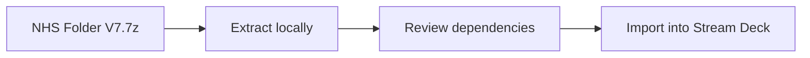

# RPUK Stream Deck Profiles

  
  

  
  

An archive repository containing an exported Stream Deck profile package for RPUK use.

## Contents

- `NHS Folder V7.7z`, the packaged profile/archive.

The repository does not contain source code or an automated build. The archive is the distributable artifact.

## Using the profile

1. Download `NHS Folder V7.7z`.
2. Extract it with 7-Zip or another compatible archive tool.
3. Review the extracted contents and any included instructions.
4. Import the appropriate profile or action files through the Elgato Stream Deck application.

## Notes

- Back up your existing Stream Deck profiles before importing.
- The profile may depend on plugins, applications, file paths, or icons that are not bundled here.
- Treat archives as binary releases: changes inside them cannot be reviewed through GitHub's normal text diff.

<!-- documentation-extras -->

## Project flow

Documentation and maintenance notes

- Commands and behaviour in this README are derived from the files currently committed to the repository.
- External services, games, websites, browser APIs, and file formats can change independently of this project.
- When reporting a problem, include the operating system, runtime version, exact command, and complete error text with secrets removed.

## Contributing

Focused fixes are welcome. Before changing behaviour, open an issue describing the problem and intended result. Keep credentials, generated secrets, personal data, and machine-specific configuration out of commits. Update this README whenever commands, configuration, paths, or supported behaviour change.

## Licence

No project-level licence is currently declared in this repository. Copyright remains with the repository owner and other contributors; obtain permission before redistributing or incorporating the code elsewhere. Third-party assets and dependencies retain their own licences.
